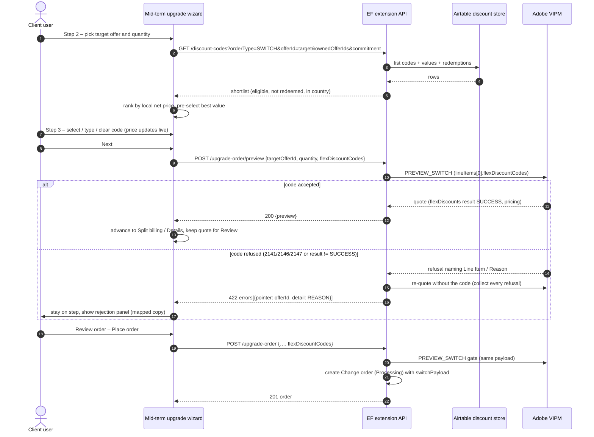
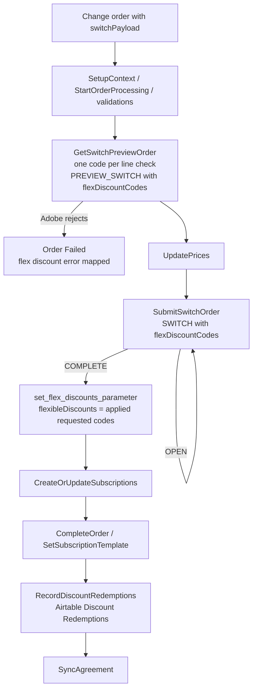

# Adobe VIPM: Flex Discounts for mid-term upgrades TDR

| | |
|---|---|
| **PM** | Meeks, Stuart |
| **Business design review** | Adobe VIPM: Flex Discounts for mid-term upgrades |
| **Architect** | _TBD_ |
| **Development team** | MPT - Sirius |
| **Status** | Draft |
| **Presentation recording** | _To be added after the review session_ |
| **Presentation date** | _TBD_ |
| **Epic/task** | _TBD (child of the Mid-term Upgrades epic and the Flex Discount Subsystem epic)_ |

Tag: `tdr`

Guideline: Technical Design Review Document Guideline

# Table of Contents

1. [Introduction](#introduction)
2. [Requirements](#requirements)
   - [Parameters](#parameters)
   - [Business Requirement](#business-requirement)
   - [Functional Requirements](#functional-requirements)
   - [Integration Requirements](#integration-requirements)
3. [Solution Overview](#solution-overview)
   - [Reuse of the renewal discount implementation](#reuse-of-the-renewal-discount-implementation)
   - [Design Overview](#design-overview)
   - [Diagrams](#diagrams)
4. [QA & Testing Plan](#qa--testing-plan)
5. [Dependencies, assumptions and open questions](#dependencies-assumptions-and-open-questions)

# Introduction

This Technical Design Review (TDR) describes the implementation of flexible discounts on
mid-term upgrades in Adobe VIP Marketplace (VIPM).

A mid-term upgrade moves a subscription to a higher-tier product partway through the term
through Adobe's `SWITCH` order. Today the mid-term upgrade wizard has no way to apply a
flexible discount: the `switchPayload` snapshot carries only the target line items and the
cancelling items, the `PREVIEW_SWITCH` gate runs without discount codes, and the switch
fulfilment pipeline never records any redemption.

The renewal wizard already implements everything a switch needs on the discount side:

- a Promotions step where the customer selects or types one code per line (shortlist plus
  manual entry),
- a preview endpoint that threads the codes into the Adobe preview order, walks every
  rejected code in one request and surfaces line-referenced reasons to the wizard,
- a payload snapshot that carries `flexDiscountCodes` per line so fulfilment sends them to
  Adobe untouched,
- fulfilment steps that record the applied codes on the order's `flexibleDiscounts`
  parameter and write the `Discount Redemptions` rows on completion.

This design **retargets that implementation to the switch**. It adds:

- a **Promotions step** (new Step 3) to the mid-term upgrade wizard, reusing the renewal
  Promotions component, with the best-value default pre-selected and the discounted
  Unit SP / SPxM / SPxY shown live on the step,
- a **switch preview endpoint** that reuses the renewal preview's rejection handling to
  validate the selected code against Adobe's `PREVIEW_SWITCH` before the wizard advances,
- `flexDiscountCodes` on the **target line items of the `switchPayload`**, so the existing
  `PREVIEW_SWITCH` gate on submission and the `SWITCH` order at fulfilment carry the code,
- the **redemption write** on the switch fulfilment pipeline, which today has no equivalent
  of the NEW-order `set_flex_discounts_parameter` + `RecordDiscountRedemptions` pair.

Adobe's `PREVIEW_SWITCH` is authoritative for both eligibility and price. The local
pre-filter and the local net-price ranking follow the subsystem's asymmetry rule: they only
strip positive contradictions and let Adobe adjudicate the rest.

Scope boundaries (from the BDR):

- In scope: the Promotions step, the discount on `PREVIEW_SWITCH` / `SWITCH`, the redemption
  recording on switch completion.
- Out of scope: the mid-term upgrade capability itself, the Flex Discount Subsystem itself,
  revert of a switch, and the automatic (non-wizard) order flows.

# Requirements

## Parameters

No new platform parameter is created. Two existing parameters are extended or reused:

- **`switchPayload`** (existing, `backend/migrations/20260715120000_switch_payload_parameter.py`)
  - Type: DataObject (Json)
  - Scope: Order
  - Phase: Order
  - Context: Change
  - Constraints: Hidden, ReadOnly
  - Change: each entry of `lineItems` may now carry `flexDiscountCodes` (a list with at most
    one code). `cancellingItems` never carry codes. The field is optional so an order placed
    before this increment keeps deserialising.

- **`flexibleDiscounts`** (existing, fulfilment extension `Param.FLEXIBLE_DISCOUNTS`)
  - Type: Json
  - Scope: Order
  - Phase: Fulfillment
  - Constraints: Hidden, ReadOnly
  - Change: none in its definition. The switch fulfilment pipeline starts populating it
    after the `SWITCH` order completes, with the codes Adobe reports as applied
    (`flexDiscounts[].result == SUCCESS`) restricted to the code the order requested per
    line. It is the source of the redemption write, exactly as for NEW orders.

The agreement-level clearing of that parameter (`NullifyFlexDiscountParam`) clears the
agreement's parameter, not the order's, so it does not affect the switch's audit or
redemption. Its purpose is to be confirmed with engineering but it does not gate this work.

## Business Requirement

When a client user upgrades a subscription mid-term through the wizard, the system must:

- Offer the flexible discount codes applicable to the **target offer** (shortlist from the
  discount store, plus reusable codes the customer already holds), filtered on the `SWITCH`
  order type and pre-filtered on the customer's commitment (3YC / annual) contradictions only.
- Pre-select the **best-value** candidate (lowest net price computed locally from Discount
  Values), with the tie-break: reusable over non-reusable, then closed over open, then
  `adobe_discount_id` ascending. The user can change or clear it.
- Let the user **type a code** that is not in the shortlist (manual-entry escape hatch).
- Show the **discounted price** (Unit SP, SPxM, SPxY) on the Promotions step as soon as a
  code is selected, typed or cleared, and again on Review order.
- Validate the code through **`PREVIEW_SWITCH`** before the wizard advances and surface any
  rejection with the line-referenced copy of the reason-code mapping (generic fallback for an
  unknown reason). No automatic cascade to another code: a human is present.
- Carry the applied code on the **target line items only** of the `SWITCH` order, for full
  and partial upgrades alike. One code per line (Adobe error 2147).
- **Record the redemption** after the `SWITCH` order succeeds, from the codes Adobe reports
  as applied on the created order.

## Functional Requirements

### Mid-term upgrade wizard (Client only)

The wizard becomes seven steps: Upgrade from (1), Upgrade to (2), **Promotions (3)**,
Split billing (4, only when the subscription has an active split), Details (5),
Review order (6), Summary (7). Steps 4, 5 and 7 are unchanged.

Promotions step:

- The step needs the resolved target offer and quantity, so it renders the single **target
  line** selected on Step 2 (item, target SKU, new qty display-only, Unit SP, discount code
  control, SPxM, SPxY, Undo).
- On entry the step loads the shortlist for the target SKU (`GET /api/v2/discount-codes` with
  `orderType=SWITCH`, `offerId=<target SKU>`, `ownedOfferIds=<held SKUs>` and
  `commitment=<ANNUAL|THREE_YC>`), ranks the candidates by local net price and pre-selects the
  best one. A code the customer has already redeemed (single-use) is listed as disabled, as in
  the renewal step.
- The `CodeCombobox` control lists the shortlist and accepts free text. A typed code that is
  not in the shortlist shows the "unknown code" neutral notice (same copy as the renewal
  wizard) and is still sent to the preview: Adobe decides.
- Pricing updates live: the row's Unit SP / SPxM / SPxY show
  `getDiscountedUnitPrice(unitSP, discount)` for a known code and the list price for a cleared
  or unknown code.
- Next runs the switch preview. On rejection the step stays and shows the rejection panel
  (`Adobe rejected the following discount codes:` + one line per code with the mapped reason).
  A reusable code Adobe auto-applied and then refused surfaces through the same panel; it is
  never silently dropped.
- The step never edits quantity or target.

Review order step:

- Shows the same discounted figures as the Promotions step for the target row, using the
  `PREVIEW_SWITCH` quote (`pricing.discountedPartnerPrice` with the item markup, as the
  renewal Review step does) when available, falling back to the local estimate.
- Place order sends `flexDiscountCodes` with the target selection.

### Backend – EF extension (`mpt-adobe-vipm-ef-extension`)

- **Shortlist** (`GET /api/v2/discount-codes`): the endpoint already supports
  `orderType=SWITCH` (`DiscountOrderType.SWITCH`), the target SKU (`offerId`), the owned SKUs
  (`ownedOfferIds`) and the commitment (`commitment`). The one functional change is the order
  type rule: `SWITCH` is an explicit order type, so a code with empty `applicable_order_types`
  (offered to any other order type) is excluded from a switch shortlist, and only codes that
  list `SWITCH` are offered. The INTRO category gate currently offers INTRO codes on `NEW`
  only; see the open question on INTRO for switches.
- **New preview endpoint**
  `POST /api/v2/agreements/{agreement_id}/subscriptions/{subscription_id}/upgrade-order/preview`:
  - Same body as the submission minus notes / external ids, plus `flexDiscountCodes`.
  - Runs the same validations as the submission (client account, active agreement, source
    line and Adobe subscription id, quantity within 1..source), builds the `switchPayload`
    with the code on the target line and calls Adobe `PREVIEW_SWITCH`.
  - Reuses the renewal preview's rejection handling (quote, detect refused codes from an
    Adobe 2141/2146/2147 error or from a `flexDiscounts[].result != SUCCESS` on a successful
    quote, strip and re-quote, report every refusal at once) and answers `422` with
    `errors[].pointer = <target offerId>` and `errors[].detail = <reason>`.
  - On success returns `{"preview": <Adobe PREVIEW_SWITCH body>}` so the wizard reads the
    discounted `lineItems[].pricing`.
- **Submission** (`POST .../upgrade-order`, existing): the body accepts `flexDiscountCodes`
  (max one code); `build_switch_payload` copies it onto the target line item; the existing
  `_preview_switch` gate therefore already carries the code and rejects a code Adobe refuses
  at submission time (defence in depth, the wizard already previewed it). The order is
  created exactly as today with the extended snapshot.
- **`SwitchLineItem`** gains `flex_discount_codes: list[str]` (alias `flexDiscountCodes`,
  default empty, max length 1). `SwitchCancellingItem` is unchanged.

### Fulfilment – `swo-adobe-vipm-extension`

- `SubmitSwitchOrder` already forwards the `switchPayload` verbatim to Adobe
  (`_build_switch_order_payload`), so `flexDiscountCodes` on the target line reach the
  `SWITCH` order with no change. `GetSwitchPreviewOrder` already enforces the
  one-code-per-line rule and maps Adobe 2147.
- **New**: once the `SWITCH` order is `COMPLETE`, `SubmitSwitchOrder` writes the order's
  `flexibleDiscounts` fulfilment parameter with `set_flex_discounts_parameter(order,
  adobe_order, requested_codes)`, where `requested_codes` maps each `extLineItemNumber` of the
  payload's `lineItems` to its requested code. Only codes Adobe reports as applied are
  recorded, and an auto-applied code the order did not request is not.
- **New**: `RecordDiscountRedemptions(get_order_redeemed_codes)` is appended to
  `fulfill_switch_order` after `CompleteOrder` / `SetSubscriptionTemplate`, mirroring the
  change and purchase pipelines. It reads the parameter above, drops codes already redeemed by
  the customer (a reusable applied again is not a fresh redemption) and writes one
  `Discount Redemptions` row per code. The write is best effort: an Airtable failure is
  logged and notified, never fails the completed order.
- `NullifyFlexDiscountParam` is **not** added to the switch pipeline (agreement-level, out of
  scope); to be confirmed with engineering.

## Integration Requirements

| Verb | Endpoint | Explanation | Body | Response |
|---|---|---|---|---|
| GET | `/api/v2/discount-codes?agreement={agreementId}&orderType=SWITCH&offerId={targetSku}&ownedOfferIds={sku1,sku2}&commitment={ANNUAL\|THREE_YC}&limit=&offset=` (EF, existing) | Shortlist for the target line. Applies order type, validity window, INTRO category, target SKU, qualifying SKUs, commitment contradiction, country and once-per-customer gates. | – | Paginated list of `Discount` (`code`, `name`, `source`, `reusable`, `discountType`, `values[]`, `applicableOrderTypes`, `supportsAnnual`, `supports3yc`, `adobeDiscountId`, `redeemedAt`, …) |
| POST | `/api/v2/agreements/{agreementId}/subscriptions/{subscriptionId}/upgrade-order/preview` (EF, **new**) | Validates the selection and the discount code through Adobe `PREVIEW_SWITCH`; returns the quote. | `{"targetOfferId": "65304520CA01A12", "quantity": 10, "recommendationTrackerId": "", "flexDiscountCodes": ["UPGRADE10"]}` | `200 {"preview": {…Adobe PREVIEW_SWITCH body…}}` or `422 {"detail": "Adobe rejected one or more discount codes", "errors": [{"pointer": "65304520CA01A12", "detail": "NEW_TO_PRODUCT_NOT_MET"}]}` |
| POST | `/api/v2/agreements/{agreementId}/subscriptions/{subscriptionId}/upgrade-order` (EF, existing, body extended) | Gates through `PREVIEW_SWITCH` and creates the Change order (Processing) carrying `switchPayload`. | `{"targetOfferId": "…", "quantity": 10, "recommendationTrackerId": "", "flexDiscountCodes": ["UPGRADE10"], "notes": "", "externalIds": {"client": ""}}` | `201` MPT order |
| POST | `{{adobeBaseUrl}}/v3/customers/{{customerId}}/orders` (Adobe, existing call, body extended) | `PREVIEW_SWITCH` quote with the code on the target line. Header `x-recommendation-tracker-id` when the target came from a recommendation. | `{"orderType": "PREVIEW_SWITCH", "currencyCode": "USD", "lineItems": [{"extLineItemNumber": 1, "offerId": "65304520CA01A12", "quantity": 10, "flexDiscountCodes": ["UPGRADE10"]}], "cancellingItems": [{"extLineItemNumber": 1, "referenceLineItemNumber": 1, "subscriptionId": "eb9acc0ee54055aaaf5794e1d7508bNA", "quantity": 10}]}` | `lineItems[].pricing.{partnerPrice, discountedPartnerPrice, netPartnerPrice, lineItemPartnerPrice}` and `lineItems[].flexDiscounts[].{code, result}` with `result` `SUCCESS` or a failure reason; or error `2141` / `2146` / `2147` with `additionalDetails` naming `Line Item: n` and `Reason: <CODE>` |
| POST | `{{adobeBaseUrl}}/v3/customers/{{customerId}}/orders` (Adobe, existing call, fulfilment) | `SWITCH` order built from the `switchPayload` snapshot. | Same as the preview with `"orderType": "SWITCH"` and `externalReferenceId` = MPT order id | Adobe order with `orderId`, `status`, `lineItems[].flexDiscounts[]` |
| PUT | MPT `orders/{orderId}` parameters (fulfilment, existing helper) | Writes `flexibleDiscounts` fulfilment parameter: `[{"extLineItemNumber": 1, "offerId": "…", "subscriptionId": "…", "flexDiscountCode": ["UPGRADE10"]}]` | – | – |
| POST | Airtable `Discount Redemptions` (fulfilment, existing helper) | One row per redeemed code (code, customer id, MPT order id, redeemed_at). | – | – |

Sample `PREVIEW_SWITCH` response fragment (discount applied):

```json
{
  "orderType": "PREVIEW_SWITCH",
  "lineItems": [
    {
      "extLineItemNumber": 1,
      "offerId": "65304520CA01A12",
      "quantity": 10,
      "flexDiscountCodes": ["UPGRADE10"],
      "flexDiscounts": [{ "code": "UPGRADE10", "result": "SUCCESS" }],
      "pricing": {
        "partnerPrice": 230.64,
        "discountedPartnerPrice": 207.58,
        "netPartnerPrice": 207.58,
        "lineItemPartnerPrice": 2075.80
      }
    }
  ],
  "cancellingItems": [
    { "extLineItemNumber": 1, "referenceLineItemNumber": 1, "subscriptionId": "eb9acc0ee54055aaaf5794e1d7508bNA", "quantity": 10 }
  ]
}
```

Sample `PREVIEW_SWITCH` rejection (Adobe fails the whole request):

```json
{
  "code": "2146",
  "message": "Flex discount code does not qualify",
  "additionalDetails": ["Line Item: 1", "Reason: NEW_TO_PRODUCT_NOT_MET"]
}
```

# Solution Overview

The switch discount flow is the renewal discount flow with a different Adobe order type and
a single target line. The EF extension already owns the pieces on the renewal side; the
fulfilment extension already owns the audit and redemption pieces on the NEW-order side. This
increment threads them through the switch.

## Reuse of the renewal discount implementation

| Concern | Renewal implementation (existing) | Switch implementation (this TDR) |
|---|---|---|
| Wizard step | `request-renewal-action/PromotionsStep` (grid, `CodeCombobox`, `useAllDiscounts(agreementId, 'RENEWAL')`, unknown-code notice, rejection panel) | New `request-midterm-upgrade-action/PromotionsStep` built on the same shared pieces (`CodeCombobox`, `useAllDiscounts(agreementId, 'SWITCH')`, `toRejectionMessage`, `toDiscountErrorMessage`), single target row, live discounted pricing |
| Shortlist | `GET /discount-codes?orderType=RENEWAL` + client-side `appliesToRenewal` / `appliesToOffer` | `GET /discount-codes?orderType=SWITCH&offerId&ownedOfferIds&commitment` (server-side eligibility already implemented) + client-side ranking by net price |
| Candidate ranking | Not needed (no pre-selection) | New `utils/discountRanking.ts`: net price from `getDiscountedUnitPrice`, tie-break reusable → closed → `adobeDiscountId` |
| Preview gate | `useRenewalDiscountValidation` → `POST /renewal-order/preview` | New `useSwitchDiscountValidation` → `POST /upgrade-order/preview` (same guarded-request pattern, same response reading) |
| Adobe preview | `order.preview_renewal_order` (`PREVIEW_RENEWAL`) | `order.preview_switch_order` (`PREVIEW_SWITCH`, existing client method) |
| Rejection walk | `_quote_until_accepted`, `_quote_once`, `_refused_discounts`, `_rejected_line_detail`, `_rejection_reason`, `_strip_rejected_codes` in `routers/api/renewal.py` | **Extracted** to `services/discount_preview.py` and parameterised on the quote callable, used by both routers |
| Payload snapshot | `RenewalPayloadSubscription.flexDiscountCodes` | `SwitchLineItem.flexDiscountCodes` |
| One code per line | Fulfilment `_enforce_one_flex_discount_code` (renewal) | Fulfilment `_get_flex_discount_limit_violation` (switch, **already exists**) + schema `max_length=1` on the EF body |
| Audit parameter | `set_flex_discounts_parameter` in `SubmitNewOrder` | Same helper called from `SubmitSwitchOrder` once the Adobe order is `COMPLETE` |
| Redemption | `RecordDiscountRedemptions(get_order_redeemed_codes)` in change / purchase pipelines | Same step appended to `fulfill_switch_order` |
| Reason copy | `Renewal:Promotions:Rejected:*` i18n keys | Reused as-is (the vocabulary is Adobe's, not the order type's) |

## Design Overview

### EF backend

**Models** (`mpt_adobe_vipm_ef/models/switch.py`)

```python
class SwitchLineItem(APIBaseModel):
    ext_line_item_number: int = Field(alias="extLineItemNumber")
    offer_id: str = Field(alias="offerId")
    quantity: int
    flex_discount_codes: list[str] = Field(default_factory=list, alias="flexDiscountCodes")


class UpgradePreviewRequest(BaseSchema):
    target_offer_id: str = Field(alias="targetOfferId", min_length=MIN_LENGTH, max_length=MAX_LENGTH)
    quantity: int = Field(gt=0)
    recommendation_tracker_id: str = Field(default="", alias="recommendationTrackerId", max_length=MAX_LENGTH)
    flex_discount_codes: list[str] = Field(default_factory=list, alias="flexDiscountCodes", max_length=1)


class UpgradeOrderRequest(UpgradePreviewRequest):
    notes: str = Field(default="", max_length=NOTES_MAX_LENGTH)
    external_ids: OrderExternalIds = Field(default_factory=OrderExternalIds, alias="externalIds")
```

`build_switch_payload` normalises the codes (trim, upper case, drop empties) and puts them on
the target `lineItems[0]` only. Cancelling items never carry codes.

**Shared preview service** (`mpt_adobe_vipm_ef/services/discount_preview.py`, extracted from
`routers/api/renewal.py`)

```python
QuoteCall = Callable[[list[Line]], Awaitable[dict[str, Any]]]

async def quote_until_accepted(quote: QuoteCall, line_items: list[Line]) -> tuple[dict | None, list[RejectedCode]]
def refused_discounts(preview: dict) -> list[RejectedCode]
def rejected_line_detail(error: AdobeAPIError, line_items: list[Line]) -> RejectedCode
def raise_if_rejected(preview, rejections) -> None   # ValidationError with pointer/detail per rejection
```

The renewal router keeps its behaviour and calls the service with a `PREVIEW_RENEWAL` quote
callable; the upgrade router calls it with a `PREVIEW_SWITCH` callable that re-sends the same
`cancellingItems` on every pass. `_line_pointer` stays `subscriptionId or offerId`, which for
a switch target resolves to the target offer id the wizard holds on its row.

**Upgrade router** (`routers/api/upgrade.py`)

- `POST .../upgrade-order/preview` (new): `_require_client_account`, `load_agreement`,
  `require_active_agreement`, `_load_switch_source`, `_validate_quantity`,
  `_require_target_item_id`, `build_switch_payload`, then
  `quote_until_accepted(preview_switch(...), payload["lineItems"])` and returns
  `{"preview": quote}`. Adobe errors outside the flex-discount codes keep today's mapping
  (`UpstreamServiceError` / `ValidationError`).
- `POST .../upgrade-order` (existing): `_preview_switch` becomes a call to the same service
  so a refused code is answered as a `422` with pointer/detail rather than a generic upstream
  error. Everything after the gate is unchanged.

**Shortlist** (`routers/api/discounts.py`, `services/discount_mapping.py`):
`applies_to_order_type` treats an empty `applicable_order_types` as "any order type" except
for the order types in `_EXPLICIT_ORDER_TYPES`, which holds `SWITCH`. A switch shortlist
therefore excludes codes with empty applicable order types and keeps only the codes that list
`SWITCH` explicitly; every other order type keeps today's behaviour. If Adobe confirms INTRO
applies to a switch target,
`allows_category` is extended to `order_type in (NEW, SWITCH)` and the open-sync enrichment
of INTRO rows adds `SWITCH` to `applicable_order_types`.

### EF frontend

- `request-midterm-upgrade-action/App.tsx`: new state `discountCode: string | null`
  (`null` until the customer chooses, which lets the best-value code be pre-selected; `''`
  once the customer clears it), `switchPreview: SwitchPreview | null`; new step after
  Upgrade to; `placeOrder` sends
  `flexDiscountCodes: discountCode ? [discountCode] : []`. The Review rows for the target use
  the quoted `discountedPartnerPrice` with the item markup when a preview exists.
- `request-midterm-upgrade-action/PromotionsStep/PromotionsStep.tsx`: renders the target row.
  On mount: `useAllDiscounts(agreement.id, 'SWITCH', { offerId, ownedOfferIds, commitment })`
  (the hook gains optional eligibility params), `rankDiscounts(candidates, unitSP)` and
  pre-select the first one unless the user already chose. Live pricing via
  `getDiscountedUnitPrice`. `registerOnNextCallback` runs `useSwitchDiscountValidation` and
  blocks Next on rejection.
- `shared/hooks/useSwitchDiscountValidation.ts`: guarded POST to `.../upgrade-order/preview`,
  publishes the quote to the parent (same shape as `useRenewalDiscountValidation`).
- `utils/discountRanking.ts`: `rankDiscounts(discounts, unitSP)` → sorted by net unit price
  ascending, ties by `reusable` desc, `source !== 'Open'` desc, `adobeDiscountId` asc. A code
  whose value cannot be priced (no `values[0].value`) ranks last.
- Commitment for the shortlist: `THREE_YC` when the agreement's 3YC parameters report an
  accepted / committed / active commitment, `ANNUAL` otherwise (same reading the
  `three-year-commitment` module already does for the commitment action).
- i18n: `MidtermUpgrade:Steps:Promotions`, `MidtermUpgrade:Promotions:Prompt`
  ("Select or type a discount code for the upgraded item. The discounted price is shown
  below and again on Review order."); rejection copy reuses `Renewal:Promotions:Rejected:*`.

### Fulfilment (`swo-adobe-vipm-extension`)

`adobe_vipm/flows/fulfillment/switch.py`:

```python
def _requested_codes(switch_payload) -> dict[int, str]:
    return {
        line["extLineItemNumber"]: line["flexDiscountCodes"][0]
        for line in switch_payload.get("lineItems", [])
        if line.get("flexDiscountCodes")
    }

class SubmitSwitchOrder(Step):
    def __call__(self, client, context, next_step):
        ...
        if adobe_order_status != AdobeOrderStatus.COMPLETE:
            ...
        context.order = set_flex_discounts_parameter(
            context.order, adobe_order, requested_codes=_requested_codes(get_switch_payload(context.order))
        )
        update_order(client, context.order_id, parameters=context.order["parameters"])
        next_step(client, context)


pipeline = Pipeline(
    ...,
    SubmitSwitchOrder(),
    CreateOrUpdateSubscriptions(),
    CompleteOrder(TEMPLATE_NAME_CHANGE),
    SetSubscriptionTemplate(),
    RecordDiscountRedemptions(get_order_redeemed_codes),   # new
    SyncAgreement(),
)
```

The parameter write is idempotent (it overwrites the same value on a retry) and happens
before `CompleteOrder`, so a retry between completion and the redemption write finds the
codes on the order. `RecordDiscountRedemptions` already skips codes with an existing
redemption row for the customer, so a retry never duplicates rows.

## Diagrams

### Wizard flow – Promotions step and preview



### Fulfilment flow – switch with discount



# QA & Testing Plan

## Objective

Ensure that a flexible discount applied on a mid-term upgrade behaves correctly under all
functional scenarios, boundary conditions and failure situations:

- Correct assembly of the candidate set for the target SKU (order type, 3YC contradiction,
  once-per-customer, country) and correct best-value pre-selection.
- Manual entry of a code outside the shortlist.
- Live discounted pricing on the Promotions step and consistent figures on Review order.
- `PREVIEW_SWITCH` always precedes the `SWITCH` order and carries the code on the target line
  only.
- Rejections are line-referenced, mapped to copy, and never cascade to another code.
- The applied code is recorded on `flexibleDiscounts` and in `Discount Redemptions`, once,
  for successfully applied codes only.
- Retries and repeated operations do not duplicate orders or redemptions.

## End-to-End Testing

Wizard – Promotions step

| ID | Test Case | Expected Result |
|---|---|---|
| PS-01 | Open the wizard for a customer with open, closed and reusable codes targeting the selected target SKU | Step 3 lists exactly the codes whose `applicableOrderTypes` include `SWITCH` explicitly and match the target SKU; codes with empty `applicableOrderTypes` and codes matching only the source SKU are absent |
| PS-02 | Customer on annual commitment, one code `supports3yc` only | The 3YC-only code is not listed; codes supporting both or none stay |
| PS-03 | Customer on 3YC, one code `supportsAnnual` only | The annual-only code is not listed |
| PS-04 | Several eligible codes with different values | The lowest net-price code is pre-selected; ties resolve reusable → closed → `adobeDiscountId` |
| PS-05 | User clears the pre-selected code (Undo) | No code sent; Unit SP / SPxM / SPxY revert to list price |
| PS-06 | User types a code not in the shortlist | Neutral "unknown code" notice shown; Next still runs the preview with that code |
| PS-07 | Single-use code already redeemed by the customer | Listed disabled with "(already redeemed)" and cannot be selected or typed |
| PS-08 | Select a percentage code, a fixed-discount code and a fixed-price code | Unit SP / SPxM / SPxY update live according to the discount type and the new quantity |
| PS-09 | Partial upgrade (quantity below the source total) | The Promotions row shows the switched quantity display-only; quantity cannot be edited on this step |
| PS-10 | Subscription with active split billing | Steps order is Upgrade from, Upgrade to, Promotions, Split billing, Details, Review, Summary |

Preview, validation and rejection

| ID | Test Case | Expected Result |
|---|---|---|
| PV-01 | Next on Step 3 with an accepted code | `PREVIEW_SWITCH` is called with `lineItems[0].flexDiscountCodes=[code]` and no code on `cancellingItems`; the wizard advances; Review shows the quoted discounted price |
| PV-02 | Adobe fails the preview with 2146 `Line Item: 1`, `Reason: NEW_TO_PRODUCT_NOT_MET` | Wizard stays on Step 3; panel shows the code, the target item and the mapped copy for `NEW_TO_PRODUCT_NOT_MET` |
| PV-03 | Adobe returns a successful quote with `flexDiscounts[].result != SUCCESS` | Treated as a rejection with the result as reason; the un-discounted quote is not shown as discounted |
| PV-04 | Adobe refuses with a reason not in the mapping | Generic fallback copy is shown; the raw token is not |
| PV-05 | Reusable code auto-applied by Adobe then refused | Surfaces in the same panel, not silently dropped |
| PV-06 | Adobe refuses without naming a line | Preview fails with Adobe's message; no order is created |
| PV-07 | Two codes on the target line (API call) | `422` from schema validation on preview and submission; fulfilment guard for 2147 still in place |
| PV-08 | Non-client account calls the preview endpoint | `403` |
| PV-09 | Submission with a code Adobe refuses at that moment | `422` with pointer/detail; no order created |

Fulfilment

| ID | Test Case | Expected Result |
|---|---|---|
| FF-01 | Full upgrade with an accepted code | `SWITCH` line item carries the code; source subscription terminated; `flexibleDiscounts` lists the code on line 1 with the target `offerId`; one `Discount Redemptions` row |
| FF-02 | Partial upgrade with an accepted code | Same as FF-01; source subscription keeps the residual quantity undiscounted |
| FF-03 | Upgrade without code | `flexibleDiscounts` stays empty; no redemption row |
| FF-04 | Adobe applies a reusable code the order did not request | Not recorded on `flexibleDiscounts`, no redemption row |
| FF-05 | Adobe `SWITCH` order stays `OPEN` across several runs | Parameter written once the order is `COMPLETE`; no duplicate Adobe order |
| FF-06 | Fulfilment retried after `CompleteOrder` | `RecordDiscountRedemptions` finds the existing row and writes nothing |
| FF-07 | Airtable unavailable during the redemption write | Order remains Completed; failure logged and notified |
| FF-08 | Payload with two codes on a line reaches fulfilment | `GetSwitchPreviewOrder` fails the order with the flex-discount limit error before calling Adobe |

Cross-cutting

| ID | Test Case | Expected Result |
|---|---|---|
| XC-01 | Pricing consistency | The figures on Step 3 (local estimate) and on Review order (Adobe quote with markup) are both shown; Review uses the quote when present |
| XC-02 | Renewal wizard regression | Renewal preview behaviour (rejection walk, every refusal reported at once, pointers) is unchanged after the extraction to the shared service |
| XC-03 | Discounts tab regression | Listing without `orderType` still lists every code, redeemed ones included |
| XC-04 | Order placed before this increment | A `switchPayload` without `flexDiscountCodes` still deserialises and fulfils |
| XC-05 | Code with empty `applicableOrderTypes` | Absent from the `SWITCH` shortlist; still offered on the renewal and new-purchase shortlists |

## Acceptance Criteria

The process is considered validated when all of the following hold:

- The Promotions step offers only codes eligible for `SWITCH` on the target SKU and
  pre-selects the best-value candidate; the user can change, clear or type a code.
- The discounted Unit SP / SPxM / SPxY are visible on the Promotions step at the point of
  choice and again on Review order.
- `PREVIEW_SWITCH` always precedes `SWITCH` and both carry the code on the target line only.
- Every Adobe refusal is shown on the Promotions step with line-referenced, mapped copy, and
  no other code is tried automatically.
- Only one code per line is ever sent; a second code is rejected before Adobe.
- After a successful switch, `flexibleDiscounts` on the order and the `Discount Redemptions`
  table record exactly the codes Adobe applied that the order requested, once.
- Retries and repeated operations do not produce duplicate Adobe orders or redemption rows.
- The renewal wizard, the discounts tab and orders placed before the increment behave as
  before.

# Dependencies, assumptions and open questions

Dependencies:

- Mid-term Upgrades (wizard, `switchPayload`, `PREVIEW_SWITCH` / `SWITCH`) delivered.
- Flex Discount Subsystem (store, shortlist filter with `SWITCH`, reason-code mapping,
  `Discount Redemptions`, `set_flex_discounts_parameter`, `RecordDiscountRedemptions`)
  delivered.
- Local net-price computation from Discount Values: available on the frontend as
  `getDiscountedUnitPrice` (single value entry, the customer's country resolved by the
  shortlist). This is the load-bearing dependency of the BDR and is considered satisfied.

Assumptions:

- `PREVIEW_SWITCH` reports discount outcomes like `PREVIEW_RENEWAL` does: a whole-request
  error `2141` / `2146` / `2147` with `Line Item: n` and `Reason: X` in
  `additionalDetails`, or a per-line `flexDiscounts[].result`. To be confirmed against the
  Adobe sandbox during implementation; the parsing is shared, so a difference is fixed once.
- The pointer the preview answers with is the target `offerId`, which the wizard row holds.

Open questions:

- **INTRO on a switch target**: pending Adobe confirmation whether a product new to the
  customer arriving through a switch counts as net-new. Until confirmed the shortlist keeps
  INTRO codes on `NEW` only; the manual-entry path still lets a customer type one and Adobe
  decides.
- **Visual distinction of an inherited (auto-applied reusable) code** versus a user-selected
  one on the Promotions step. To be resolved with product; not blocking.
- **`NullifyFlexDiscountParam`**: agreement-level clearing, orthogonal to the switch's
  order-level audit. Engineering to confirm whether the switch pipeline should also run it.
